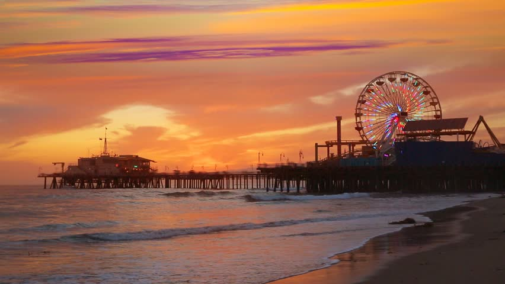
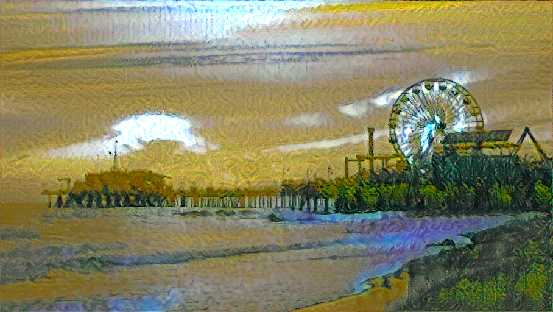

# Style_transfer_combo

Pytorch based implementations of style transfer algorithms . 

## Completed:
- Implementation of the basic algorithm mentioned in Leon Gatys's paper https://www.cv-foundation.org/openaccess/content_cvpr_2016/papers/Gatys_Image_Style_Transfer_CVPR_2016_paper.pdf

- CPU and GPU support enabled .

## Running the code:
The style transfer code can be run using `run_style_transfer.py` as follows:
- For enabling GPU use:  
`python run_style_transfer.py --style_path '../images/wheat_field_van_gogh.jpg' --content_path '../images/santa_monica.jpg' --result_dir '../images' --max_epochs 60 --device 'cuda'`
- For using CPU use:
`python run_style_transfer.py --style_path '../images/wheat_field_van_gogh.jpg' --content_path '../images/santa_monica.jpg' --result_dir '../images' --max_epochs 60 --device 'cpu'`
 

## Results:
Left to Right (Style Image, Content Image, Result)

  
  
  

The above results have been generated after running the model in CPU. Due to limited memory of NVIDIA 940 MX GPU (4 GB) at my disposal, the optimization has been done using CPU.

## TODO:
- Supporting more architectures like mobilenet
- Training the model with coco images
- Automatic weight selection
- Photorealistic image generation 
